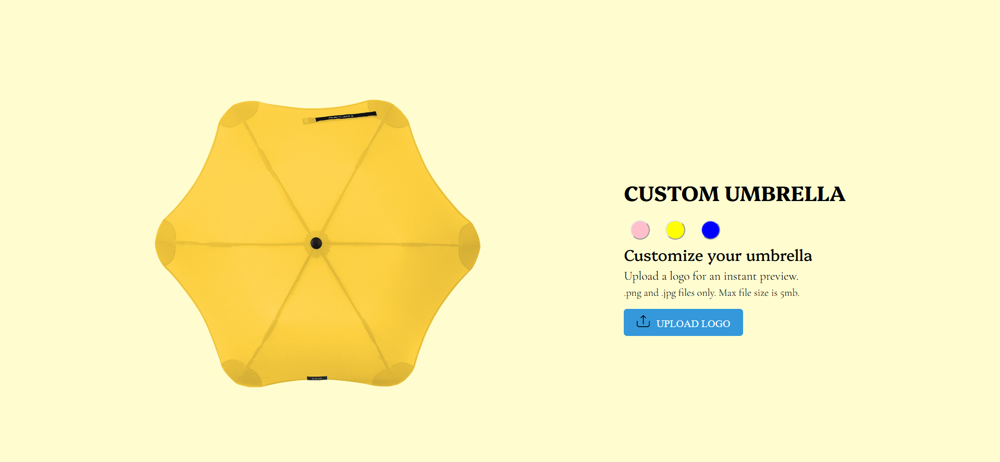
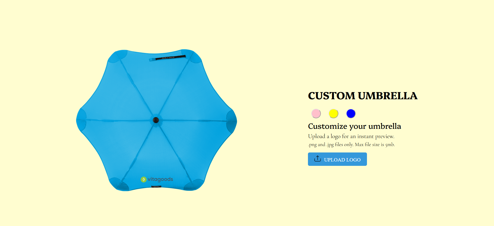

# Umbrella Customizer

This project allows users to preview and customize umbrellas with different colors and logos.

## Features

- Choose from multiple umbrella colors: pink, yellow, and blue.
- Upload a logo to preview it on the umbrella.
- Supports .png and .jpg files with a maximum size of 5mb.
- Real-time preview of umbrella customization.

## Technologies Used

- HTML
- CSS
- JavaScript

## Setup

1. Clone the repository:

   ```bash
   git clone https://github.com/TechnoPhasePRO/umbrella-customizer.git
2. Open index.html in web browser.

## Screenshots



## Usage
- Click on the color buttons to select the umbrella color.
- Upload a logo using the "UPLOAD LOGO" button.
- Preview the customized umbrella in real-time.

## License
This project is licensed under the [MIT License](LICENSE).